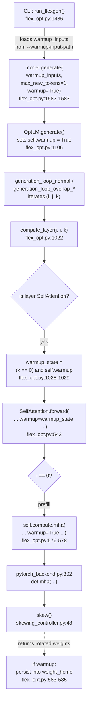
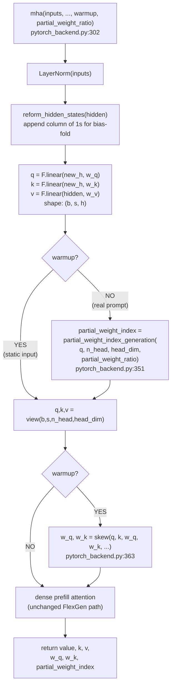
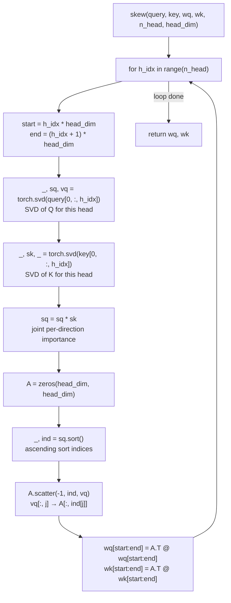
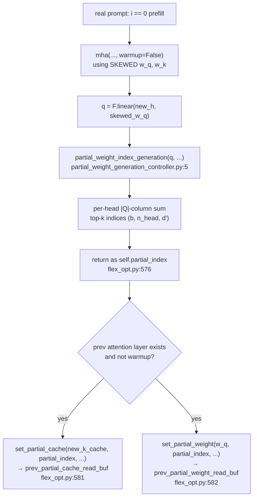
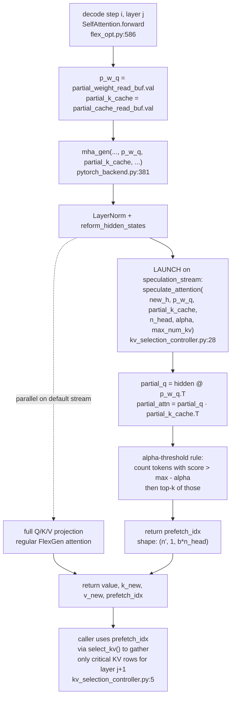
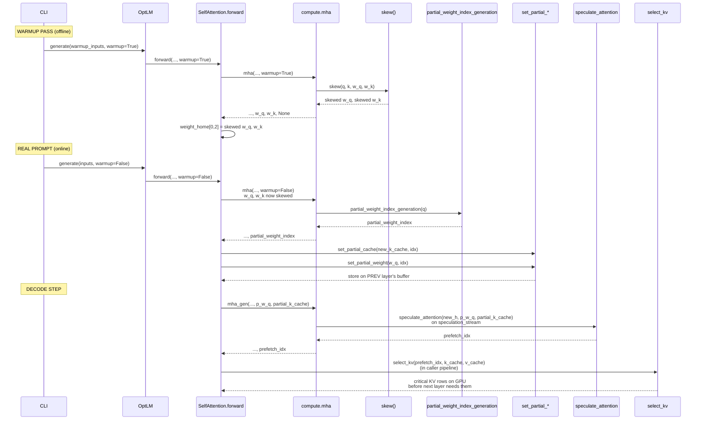

# InfiniGen Warmup Flow — Generating the Skewed and Partial Q/K Weights

This document traces the call graph that runs during InfiniGen's warmup pass and shows how the resulting **skewed weights** and (later) **partial Q-weight / partial K-cache** are produced and consumed. All references use `file:line` form so you can click straight into the source.

> Note: `speedup/flexgen/flexgen/flex_opt.py` and `speedup/flexgen/flexgen/pytorch_backend.py` are symlinks to the real files in `speedup/flexgen/infinigen/`. Line numbers below point at the real files.

---

## 1. Two-Phase Mental Model

InfiniGen splits work into two phases:

| Phase | Trigger | Input | Produces | Persisted? |
|---|---|---|---|---|
| **Offline (warmup)** | `model.generate(... warmup=True)` | a static / representative prompt | per-head **skewing rotation** baked into `W_Q`, `W_K` | yes — written back into `weight_home` |
| **Online (real run)** | `model.generate(...)` after warmup | actual prompts | per-prompt `partial_index`, `partial_weight` (sliced `W_Q`), `partial_cache` (sliced K), `prefetch_idx` | only across one decode loop |

The offline phase happens **once** before benchmarking. The skewed `W_Q`/`W_K` it produces are loaded by every real prompt that follows.

---

## 2. Top-Level Call Graph (Warmup Pass)



**Key observation:** during warmup, `compute_layer` only triggers the warmup path on `k == 0` (the first GPU batch). Subsequent batches in the same warmup run reuse what the first batch computed.

---

## 3. The `mha()` Decision Tree

`mha()` is the prefill kernel. It has two InfiniGen-specific branches gated by the `warmup` flag.



| Flag | Path taken | Output of interest |
|---|---|---|
| `warmup=True` | runs `skew()`, **skips** `partial_weight_index_generation` | new `w_q`, `w_k` (skewed) |
| `warmup=False` | runs `partial_weight_index_generation`, **skips** `skew()` | `partial_weight_index` |

The two paths are deliberately mutually exclusive: index generation needs the skewed weights to be meaningful, so it cannot run on the warmup pass where skewing has not yet happened.

---

## 4. Inside `skew()` — Building the Rotation

File: [skewing_controller.py:48-84](../infinigen/skewing_controller.py)



**What you should remember:**
- `vq` are the right-singular vectors of Q for one head.
- `sq * sk` ranks each direction by the magnitude it contributes to Q·Kᵀ.
- `A` is just `vq` with columns reordered so importance increases left-to-right.
- `Aᵀ @ W` rotates the Q (and K) projection rows into that ordered basis.
- Because `AᵀA ≈ I` and the **same** A is applied to both Q and K, attention scores are mathematically unchanged. Only the **layout of importance across columns** changes.

After `skew()` returns, the caller in `SelfAttention.forward` writes the new weights back to `weight_home`:

```python
# flex_opt.py:583-585
if warmup:
    weight_home.val[0] = w_q.smart_copy(weight_home.val[0].device)[0]
    weight_home.val[2] = w_k.smart_copy(weight_home.val[2].device)[0]
```

`weight_home.val[0]` is `W_Q` and `weight_home.val[2]` is `W_K` for that layer. From this point on, every prompt loads the **skewed** weights; the offline phase is done.

---

## 5. Online Phase — Where Skewed Weights Pay Off

After warmup, normal prefill+decode runs. The same `mha()` is called with `warmup=False`, so the bottom branch fires:



So during prefill of layer `j`, two small tensors are produced and stored on layer `j-1`'s buffers:

| Buffer (on prev layer) | Contents | Shape |
|---|---|---|
| `prev_partial_cache_read_buf` | sliced K cache: only `d'` columns per head | `(n, b*n_head, d')` |
| `prev_partial_weight_read_buf` | sliced `W_Q`: only `d'` rows per head | `(D', D)` where `D' = n_head * d'` |

Why **prev** layer? Because during decoding of layer `j-1`, we want to predict which KV tokens layer `j` will need. To do that cheaply we need layer `j`'s partial weights/cache available *while* layer `j-1` is computing.

---

## 6. Decoding — Speculation and Prefetch



The `with torch.cuda.stream(speculation_stream):` block at [pytorch_backend.py:402-403](../infinigen/pytorch_backend.py) launches the speculation on a **separate CUDA stream**, so it overlaps with the regular dense/sparse attention compute in the default stream.

---

## 7. End-to-End Lifecycle of the Skewed/Partial Tensors



---

## 8. Variable Glossary

<details>
<summary><b>Click to expand the variable cheat sheet</b></summary>

| Variable | Where defined | Shape | Meaning |
|---|---|---|---|
| `warmup` | [flex_opt.py:1090](../infinigen/flex_opt.py), [flex_opt.py:1106](../infinigen/flex_opt.py) | bool | Top-level flag; `True` only during the static-input pre-pass |
| `warmup_state` | [flex_opt.py:1029](../infinigen/flex_opt.py) | bool | Per-step flag; `(k == 0) and self.warmup` |
| `partial_weight_ratio` | CLI flag, default 0.2 | float | Fraction of columns to keep as "partial" (paper's *r*) |
| `vq` | [skewing_controller.py:73](../infinigen/skewing_controller.py) | `(head_dim, head_dim)` | Right-singular vectors of Q for one head |
| `sq` | [skewing_controller.py:78](../infinigen/skewing_controller.py) | `(head_dim,)` | Joint Q·K importance per direction (after multiply) |
| `A` | [skewing_controller.py:79-81](../infinigen/skewing_controller.py) | `(head_dim, head_dim)` | Column-permuted `vq` ordered by joint importance |
| `w_q.data`, `w_k.data` (post-warmup) | [pytorch_backend.py:363](../infinigen/pytorch_backend.py) | `(D, D+1)` | **Skewed** Q/K projection weights |
| `partial_index` (a.k.a. `partial_weight_index`) | [partial_weight_generation_controller.py:5](../infinigen/partial_weight_generation_controller.py) | `(b, n_head, d')` | Per-head top-k column indices, picked from skewed Q |
| `p_w_q` (partial Q-weight) | [partial_weight_generation_controller.py:68](../infinigen/partial_weight_generation_controller.py) | `(D', D)` | Sliced `W_Q` — `d' = head_dim * partial_weight_ratio` rows per head |
| `partial_k_cache` | [partial_weight_generation_controller.py:42](../infinigen/partial_weight_generation_controller.py) | `(n, b*n_head, d')` | Sliced K cache along the head_dim axis |
| `prefetch_idx` | [kv_selection_controller.py:28](../infinigen/kv_selection_controller.py) | `(n', 1, b*n_head)` | Critical-token indices for the next layer's KV |
| `weight_home[layer_id]` | [flex_opt.py:584-585](../infinigen/flex_opt.py) | dict-like | Persistent home of layer weights; entries `[0]=W_Q, [2]=W_K` |
| `speculation_stream` | [flex_opt.py:1034](../infinigen/flex_opt.py) | `torch.cuda.Stream` | Side stream so speculation overlaps with attention |
| `alpha`, `max_num_kv` | CLI flags | float, int | Threshold and cap used by `speculate_attention` |

</details>

---

## 9. Key Method Reference

<details>
<summary><b>Click to expand the method reference</b></summary>

### `OptLM.generate(..., warmup=False)` — [flex_opt.py:1090](../infinigen/flex_opt.py)
Entry point. Stores `self.warmup` and dispatches to one of the generation loops.

### `OptLM.compute_layer(i, j, k)` — [flex_opt.py:1022](../infinigen/flex_opt.py)
Per-(token, layer, gpu_batch) dispatcher. Computes `warmup_state` and routes to `SelfAttention.forward` or `MLP.forward`.

### `SelfAttention.forward(...)` — [flex_opt.py:543](../infinigen/flex_opt.py)
Two-branch dispatcher:
- `i == 0` → calls `compute.mha` (prefill); on warmup, persists skewed weights.
- `i > 0` → calls `compute.mha_gen` (decode); when prefetching is enabled, threads `p_w_q` and `partial_k_cache` through.

### `compute.mha(...)` — [pytorch_backend.py:302](../infinigen/pytorch_backend.py)
Prefill kernel. Two InfiniGen branches:
- `warmup=True` → calls `skew()` to rewrite `W_Q`, `W_K`.
- `warmup=False` → calls `partial_weight_index_generation` to choose top-k columns.

### `compute.mha_gen(...)` — [pytorch_backend.py:381](../infinigen/pytorch_backend.py)
Decode kernel. If `p_w_q is not None`, runs `speculate_attention` on a side stream and returns `prefetch_idx`.

### `skew(query, key, wq, wk, n_head, head_dim)` — [skewing_controller.py:48](../infinigen/skewing_controller.py)
Per-head SVD-based rotation that re-orders W_Q/W_K columns by joint Q·K importance.

### `partial_weight_index_generation(query, n_head, head_dim, ratio)` — [partial_weight_generation_controller.py:5](../infinigen/partial_weight_generation_controller.py)
Picks top-k columns per head by absolute-sum of the (skewed) Q matrix.

### `set_partial_weight(w_q, partial_index, n_head, head_dim)` — [partial_weight_generation_controller.py:68](../infinigen/partial_weight_generation_controller.py)
Slices `W_Q` rows along the head_dim axis using `partial_index`. Returns `(D', D)`.

### `set_partial_cache(k_cache, partial_index, n_head, head_dim)` — [partial_weight_generation_controller.py:42](../infinigen/partial_weight_generation_controller.py)
Slices the K cache along the head_dim axis using `partial_index`. Returns `(n, b*n_head, d')`.

### `speculate_attention(hidden, p_w_q, p_k_c, n_head, alpha, max_num_kv)` — [kv_selection_controller.py:28](../infinigen/kv_selection_controller.py)
Computes a partial-Q from hidden, dots it against partial-K to get approximate scores, applies alpha-threshold + top-k to return `prefetch_idx`.

### `select_kv(prefetch_idx, k_cache, v_cache)` — [kv_selection_controller.py:5](../infinigen/kv_selection_controller.py)
Gathers only the rows of `k_cache`/`v_cache` named in `prefetch_idx` — the actual prefetch payload.

### `reform_hidden_states(hidden_states)` — [skewing_controller.py:29](../infinigen/skewing_controller.py)
Appends a column of 1s so bias is folded into the `(D, D+1)` weight matrix used by skewing.

</details>

---

## 10. Mental Trace — A Concrete Walkthrough

Imagine `n_head = 32`, `head_dim = 128`, `partial_weight_ratio = 0.2`, so `d' = 25`.

<details>
<summary><b>Step 1: Warmup pass on a 2048-token static input</b></summary>

1. CLI loads `warmup_inputs` of shape `(num_prompts, 2048)`. — [flex_opt.py:1486](../infinigen/flex_opt.py)
2. `model.generate(warmup_inputs, max_new_tokens=1, warmup=True)`.
3. For every layer `j` and `k == 0`:
   - `mha(..., warmup=True)` runs.
   - `q`, `k`, `v` are computed with the **original** `W_Q`/`W_K` (still un-skewed).
   - `partial_weight_index_generation` is **skipped** (because `warmup=True`).
   - `skew(q, k, w_q.data, w_k.data, 32, 128)` runs:
     - For each of the 32 heads: SVD of `Q_h` and `K_h`, build `A_h` (128×128), apply `A_hᵀ` to that head's 128 rows of `W_Q` and `W_K`.
   - Caller writes the rotated `w_q.data`, `w_k.data` back into `weight_home[j].val[0]` and `[2]`.
4. After all 32 layers (or whatever the OPT config is) finish, the warmup pass exits. The model now has *all* of its `W_Q`/`W_K` matrices replaced with skewed versions.

</details>

<details>
<summary><b>Step 2: First real prompt — prefill</b></summary>

1. `generate(inputs, max_new_tokens=gen_len, warmup=False)`.
2. For every layer `j`:
   - `mha(..., warmup=False)` runs with the **skewed** weights from `weight_home`.
   - `q = F.linear(hidden, skewed_w_q)` — a flat `(b, s, h)` tensor whose columns are now sorted by importance for each head.
   - `partial_weight_index_generation(q, 32, 128, 0.2)` picks the 25 most-important columns per head → `partial_weight_index` of shape `(b, 32, 25)`.
   - `skew()` is **skipped** (because `warmup=False`).
   - Returns `partial_weight_index` to `SelfAttention.forward`, where it is stored as `self.partial_index`.
3. Back in `SelfAttention.forward`, if this is *not* the first attention layer:
   - `set_partial_cache(new_k_cache, partial_index, 32, 128)` slices the new K cache to `(n, b*32, 25)` — call this `partial_k_cache`.
   - `set_partial_weight(w_q, partial_index, 32, 128)` slices the skewed W_Q to `(32*25, D) = (800, D)` — call this `p_w_q`.
   - **Both are pushed into the previous attention layer's buffers**, not this one.
4. By the end of prefill, every attention layer (except the last one) holds a `p_w_q` + `partial_k_cache` for the **next** layer in its read buffers.

</details>

<details>
<summary><b>Step 3: Decoding loop</b></summary>

For each new token:
1. Layer `j` runs `mha_gen(..., p_w_q, partial_k_cache, ...)`.
2. On `speculation_stream`, `speculate_attention(new_h, p_w_q, partial_k_cache, 32, alpha, max_num_kv)` runs:
   - `partial_q = new_h @ p_w_qᵀ` → cheap projection (only 800 outputs, vs full `D = 4096`).
   - `partial_attn = partial_q · partial_k_cacheᵀ` → approximate per-token attention scores.
   - Tokens with score > `max - alpha` are counted; the mean count gives `k_eff`; top-`k_eff` of those tokens (capped at `max_num_kv`) are the **critical** ones.
   - Returns `prefetch_idx`.
3. `prefetch_idx` is fed to `select_kv` (in the caller's pipeline) to gather only those KV rows from CPU/disk for **layer j+1** before that layer runs.
4. Meanwhile, layer `j`'s own attention runs to completion on the default stream, using the full KV cache.
5. At [flex_opt.py:602-603](../infinigen/flex_opt.py), the partial K cache for the previous layer is extended with this step's new K column slice — keeping speculation accurate across the growing sequence.

</details>

---

## 11. Quick Sanity Checks

- [ ] After warmup, `weight_home[j].val[0]` and `[2]` are different from the on-disk weight files. ✅
- [ ] `partial_weight_index` is **not** computed during warmup ([pytorch_backend.py:349-351](../infinigen/pytorch_backend.py): the `not warmup` guard). ✅
- [ ] `skew()` runs **only** during warmup ([pytorch_backend.py:362](../infinigen/pytorch_backend.py)). ✅
- [ ] `p_w_q` for layer `j` is written by layer `j+1`'s prefill (`prev_partial_weight_read_buf` semantics, [flex_opt.py:582](../infinigen/flex_opt.py)). ✅
- [ ] Layers 0 and 1 have `partial_weight_ratio = None` and do not participate in speculation ([flex_opt.py:276-299](../infinigen/flex_opt.py)). ✅

---

## 12. Where to Read Next

- **Paper §4.1 — Skewing**: matches `skew()` and the `if warmup:` branch of `mha()`.
- **Paper §4.2 — Partial weights & speculation**: matches `partial_weight_index_generation`, `set_partial_*`, and `speculate_attention`.
- **Paper §4.3 — Prefetching**: matches `select_kv` + the multi-stream orchestration in `mha_gen`.
